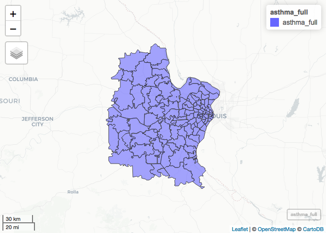
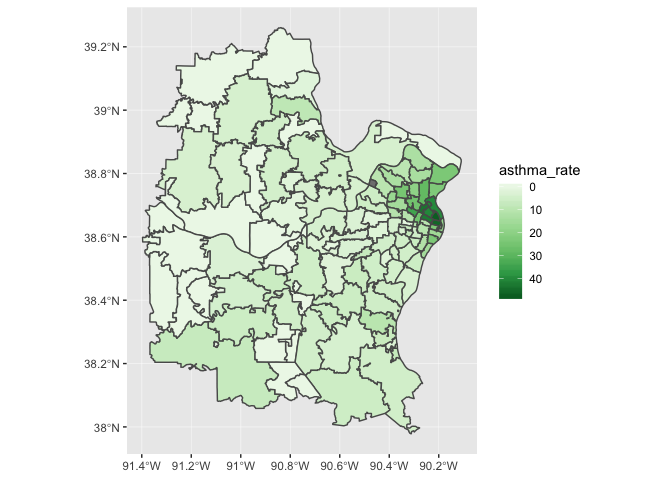

Cleaning Asthma Data
================
Ava
(December 05, 2019)

Introduction
------------

This notebook...

Dependencies
------------

This notebook requires...

``` r
# tidyverse packages
library(dplyr)       # data wrangling
```

    ## 
    ## Attaching package: 'dplyr'

    ## The following objects are masked from 'package:stats':
    ## 
    ##     filter, lag

    ## The following objects are masked from 'package:base':
    ## 
    ##     intersect, setdiff, setequal, union

``` r
library(readr)       # read/write tabular data
library(stringr)     # work with strings
library(tidyr)       # data wrangling
# spatial packages
library(janitor)     # data wrangling
library(sf)          # spatial data tools
```

    ## Linking to GEOS 3.6.1, GDAL 2.1.3, PROJ 4.9.3

``` r
library(mapview)     # projections
library(tigris)      # census data wrangling 
```

    ## To enable 
    ## caching of data, set `options(tigris_use_cache = TRUE)` in your R script or .Rprofile.

    ## 
    ## Attaching package: 'tigris'

    ## The following object is masked from 'package:graphics':
    ## 
    ##     plot

``` r
# other packages
library(here)        # file path management
```

    ## here() starts at /Users/avagagner/Desktop/Courses/Spring2019/SOC4650/GitHub/redliningAsthma-Zipcode

``` r
library(naniar)      # missing data
library(ggplot2)
library(viridis)      # palettes
```

    ## Loading required package: viridisLite

``` r
library(leaflet)
library(tidycensus) 
library(sp)
library(ggplot2)   
library(RColorBrewer)  # color palettes
library(viridis)       # color palettes
```

Load Data 2015
--------------

loading asthma data from MoPhim data base asthma is for 2015

``` r
asthma_15 <- read_csv(here("data","raw", "asthma", "asthma2015.csv"))
```

    ## Warning: Missing column names filled in: 'X3' [3]

    ## Parsed with column specification:
    ## cols(
    ##   `Title:` = col_character(),
    ##   `Missouri EPHT Asthma` = col_character(),
    ##   X3 = col_logical()
    ## )

    ## Warning: 1031 parsing failures.
    ## row col  expected    actual                                                                                                                file
    ##   1  -- 3 columns 4 columns '/Users/avagagner/Desktop/Courses/Spring2019/SOC4650/GitHub/redliningAsthma-Zipcode/data/raw/asthma/asthma2015.csv'
    ##   2  -- 3 columns 4 columns '/Users/avagagner/Desktop/Courses/Spring2019/SOC4650/GitHub/redliningAsthma-Zipcode/data/raw/asthma/asthma2015.csv'
    ##   3  -- 3 columns 4 columns '/Users/avagagner/Desktop/Courses/Spring2019/SOC4650/GitHub/redliningAsthma-Zipcode/data/raw/asthma/asthma2015.csv'
    ##   4  -- 3 columns 4 columns '/Users/avagagner/Desktop/Courses/Spring2019/SOC4650/GitHub/redliningAsthma-Zipcode/data/raw/asthma/asthma2015.csv'
    ##   5  -- 3 columns 4 columns '/Users/avagagner/Desktop/Courses/Spring2019/SOC4650/GitHub/redliningAsthma-Zipcode/data/raw/asthma/asthma2015.csv'
    ## ... ... ......... ......... ...................................................................................................................
    ## See problems(...) for more details.

Getting rid of first three rows bc they are pointless text.

``` r
asthma_15 %>%
  slice(4:1029) -> asthma_15
```

Getting rid of third col with no data. aslo renaming cols to 'count' and 'zip'

``` r
asthma_15 %>%
  select(-X3) %>%
  rename(count = `Missouri EPHT Asthma`) %>%
  rename(zip = `Title:`)-> asthma_15
```

Changing X to NA, making the count variable numeric

``` r
mutate(asthma_15, count = ifelse(count == "x", NA, count)) -> asthma_15
```

``` r
mutate(asthma_15, count = as.numeric(count)) -> asthma_15
```

\`

loading Mo zip codes

``` r
moZip <- zctas(state = "Missouri", year = 2010,
               cb = FALSE, class ="sf")
```

    ## ZCTAs can take several minutes to download.  To cache the data and avoid re-downloading in future R sessions, set `options(tigris_use_cache = TRUE)`

    ## 
      |                                                                       
      |                                                                 |   0%
      |                                                                       
      |                                                                 |   1%
      |                                                                       
      |=                                                                |   1%
      |                                                                       
      |=                                                                |   2%
      |                                                                       
      |==                                                               |   2%
      |                                                                       
      |==                                                               |   3%
      |                                                                       
      |==                                                               |   4%
      |                                                                       
      |===                                                              |   4%
      |                                                                       
      |===                                                              |   5%
      |                                                                       
      |====                                                             |   5%
      |                                                                       
      |====                                                             |   6%
      |                                                                       
      |====                                                             |   7%
      |                                                                       
      |=====                                                            |   7%
      |                                                                       
      |=====                                                            |   8%
      |                                                                       
      |======                                                           |   9%
      |                                                                       
      |======                                                           |  10%
      |                                                                       
      |=======                                                          |  10%
      |                                                                       
      |=======                                                          |  11%
      |                                                                       
      |========                                                         |  12%
      |                                                                       
      |========                                                         |  13%
      |                                                                       
      |=========                                                        |  13%
      |                                                                       
      |=========                                                        |  14%
      |                                                                       
      |=========                                                        |  15%
      |                                                                       
      |==========                                                       |  15%
      |                                                                       
      |==========                                                       |  16%
      |                                                                       
      |===========                                                      |  16%
      |                                                                       
      |===========                                                      |  17%
      |                                                                       
      |===========                                                      |  18%
      |                                                                       
      |============                                                     |  18%
      |                                                                       
      |============                                                     |  19%
      |                                                                       
      |=============                                                    |  19%
      |                                                                       
      |=============                                                    |  20%
      |                                                                       
      |=============                                                    |  21%
      |                                                                       
      |==============                                                   |  21%
      |                                                                       
      |==============                                                   |  22%
      |                                                                       
      |===============                                                  |  22%
      |                                                                       
      |===============                                                  |  23%
      |                                                                       
      |===============                                                  |  24%
      |                                                                       
      |================                                                 |  24%
      |                                                                       
      |================                                                 |  25%
      |                                                                       
      |=================                                                |  25%
      |                                                                       
      |=================                                                |  26%
      |                                                                       
      |=================                                                |  27%
      |                                                                       
      |==================                                               |  27%
      |                                                                       
      |==================                                               |  28%
      |                                                                       
      |===================                                              |  29%
      |                                                                       
      |===================                                              |  30%
      |                                                                       
      |====================                                             |  30%
      |                                                                       
      |====================                                             |  31%
      |                                                                       
      |=====================                                            |  32%
      |                                                                       
      |=====================                                            |  33%
      |                                                                       
      |======================                                           |  33%
      |                                                                       
      |======================                                           |  34%
      |                                                                       
      |======================                                           |  35%
      |                                                                       
      |=======================                                          |  35%
      |                                                                       
      |=======================                                          |  36%
      |                                                                       
      |========================                                         |  36%
      |                                                                       
      |========================                                         |  37%
      |                                                                       
      |========================                                         |  38%
      |                                                                       
      |=========================                                        |  38%
      |                                                                       
      |=========================                                        |  39%
      |                                                                       
      |==========================                                       |  39%
      |                                                                       
      |==========================                                       |  40%
      |                                                                       
      |==========================                                       |  41%
      |                                                                       
      |===========================                                      |  41%
      |                                                                       
      |===========================                                      |  42%
      |                                                                       
      |============================                                     |  42%
      |                                                                       
      |============================                                     |  43%
      |                                                                       
      |============================                                     |  44%
      |                                                                       
      |=============================                                    |  44%
      |                                                                       
      |=============================                                    |  45%
      |                                                                       
      |==============================                                   |  45%
      |                                                                       
      |==============================                                   |  46%
      |                                                                       
      |==============================                                   |  47%
      |                                                                       
      |===============================                                  |  47%
      |                                                                       
      |===============================                                  |  48%
      |                                                                       
      |================================                                 |  49%
      |                                                                       
      |================================                                 |  50%
      |                                                                       
      |=================================                                |  50%
      |                                                                       
      |=================================                                |  51%
      |                                                                       
      |=================================                                |  52%
      |                                                                       
      |==================================                               |  52%
      |                                                                       
      |==================================                               |  53%
      |                                                                       
      |===================================                              |  53%
      |                                                                       
      |===================================                              |  54%
      |                                                                       
      |===================================                              |  55%
      |                                                                       
      |====================================                             |  55%
      |                                                                       
      |====================================                             |  56%
      |                                                                       
      |=====================================                            |  56%
      |                                                                       
      |=====================================                            |  57%
      |                                                                       
      |=====================================                            |  58%
      |                                                                       
      |======================================                           |  58%
      |                                                                       
      |======================================                           |  59%
      |                                                                       
      |=======================================                          |  59%
      |                                                                       
      |=======================================                          |  60%
      |                                                                       
      |=======================================                          |  61%
      |                                                                       
      |========================================                         |  61%
      |                                                                       
      |========================================                         |  62%
      |                                                                       
      |=========================================                        |  62%
      |                                                                       
      |=========================================                        |  63%
      |                                                                       
      |=========================================                        |  64%
      |                                                                       
      |==========================================                       |  64%
      |                                                                       
      |==========================================                       |  65%
      |                                                                       
      |===========================================                      |  65%
      |                                                                       
      |===========================================                      |  66%
      |                                                                       
      |===========================================                      |  67%
      |                                                                       
      |============================================                     |  67%
      |                                                                       
      |============================================                     |  68%
      |                                                                       
      |=============================================                    |  69%
      |                                                                       
      |=============================================                    |  70%
      |                                                                       
      |==============================================                   |  70%
      |                                                                       
      |==============================================                   |  71%
      |                                                                       
      |==============================================                   |  72%
      |                                                                       
      |===============================================                  |  72%
      |                                                                       
      |===============================================                  |  73%
      |                                                                       
      |================================================                 |  73%
      |                                                                       
      |================================================                 |  74%
      |                                                                       
      |================================================                 |  75%
      |                                                                       
      |=================================================                |  75%
      |                                                                       
      |=================================================                |  76%
      |                                                                       
      |==================================================               |  76%
      |                                                                       
      |==================================================               |  77%
      |                                                                       
      |==================================================               |  78%
      |                                                                       
      |===================================================              |  78%
      |                                                                       
      |===================================================              |  79%
      |                                                                       
      |====================================================             |  79%
      |                                                                       
      |====================================================             |  80%
      |                                                                       
      |====================================================             |  81%
      |                                                                       
      |=====================================================            |  81%
      |                                                                       
      |=====================================================            |  82%
      |                                                                       
      |======================================================           |  82%
      |                                                                       
      |======================================================           |  83%
      |                                                                       
      |======================================================           |  84%
      |                                                                       
      |=======================================================          |  84%
      |                                                                       
      |=======================================================          |  85%
      |                                                                       
      |========================================================         |  85%
      |                                                                       
      |========================================================         |  86%
      |                                                                       
      |========================================================         |  87%
      |                                                                       
      |=========================================================        |  87%
      |                                                                       
      |=========================================================        |  88%
      |                                                                       
      |==========================================================       |  88%
      |                                                                       
      |==========================================================       |  89%
      |                                                                       
      |==========================================================       |  90%
      |                                                                       
      |===========================================================      |  90%
      |                                                                       
      |===========================================================      |  91%
      |                                                                       
      |============================================================     |  92%
      |                                                                       
      |============================================================     |  93%
      |                                                                       
      |=============================================================    |  93%
      |                                                                       
      |=============================================================    |  94%
      |                                                                       
      |=============================================================    |  95%
      |                                                                       
      |==============================================================   |  95%
      |                                                                       
      |==============================================================   |  96%
      |                                                                       
      |===============================================================  |  96%
      |                                                                       
      |===============================================================  |  97%
      |                                                                       
      |===============================================================  |  98%
      |                                                                       
      |================================================================ |  98%
      |                                                                       
      |================================================================ |  99%
      |                                                                       
      |=================================================================|  99%
      |                                                                       
      |=================================================================| 100%

Changing object to SF

``` r
st_as_sf(moZip) -> moZip
```

cleaning names, selecting just cols for zip and geometry, changing col name to zip

``` r
moZip %>%
  clean_names() %>%
  select(zcta5ce10, geometry) %>%
  rename(zip = `zcta5ce10`)-> moZip
```

Load Data 2014
--------------

loading data for asthma 2014

``` r
asthma_14<- read_csv(here("data","raw", "asthma", "asthma2014.csv"))
```

    ## Warning: Missing column names filled in: 'X3' [3]

    ## Parsed with column specification:
    ## cols(
    ##   `Title:` = col_character(),
    ##   `Missouri EPHT Asthma` = col_character(),
    ##   X3 = col_logical()
    ## )

    ## Warning: 1031 parsing failures.
    ## row col  expected    actual                                                                                                                file
    ##   1  -- 3 columns 4 columns '/Users/avagagner/Desktop/Courses/Spring2019/SOC4650/GitHub/redliningAsthma-Zipcode/data/raw/asthma/asthma2014.csv'
    ##   2  -- 3 columns 4 columns '/Users/avagagner/Desktop/Courses/Spring2019/SOC4650/GitHub/redliningAsthma-Zipcode/data/raw/asthma/asthma2014.csv'
    ##   3  -- 3 columns 4 columns '/Users/avagagner/Desktop/Courses/Spring2019/SOC4650/GitHub/redliningAsthma-Zipcode/data/raw/asthma/asthma2014.csv'
    ##   4  -- 3 columns 4 columns '/Users/avagagner/Desktop/Courses/Spring2019/SOC4650/GitHub/redliningAsthma-Zipcode/data/raw/asthma/asthma2014.csv'
    ##   5  -- 3 columns 4 columns '/Users/avagagner/Desktop/Courses/Spring2019/SOC4650/GitHub/redliningAsthma-Zipcode/data/raw/asthma/asthma2014.csv'
    ## ... ... ......... ......... ...................................................................................................................
    ## See problems(...) for more details.

getting rid of first three rows bc they have nothing in them

``` r
asthma_14 %>%
  slice(4:1029) -> asthma_14
```

getting rid of empty third col, renaming remaning cols

``` r
asthma_14 %>%
  select(-X3) %>%
  rename(count = `Missouri EPHT Asthma`) %>%
  rename(zip = `Title:`) -> asthma_14
```

changing X to NA, changing to numeric

``` r
mutate(asthma_14, count = ifelse(count == "x", NA, count)) -> asthma_14
```

``` r
mutate(asthma_14, count = as.numeric(count)) -> asthma_14
```

left join to asthma\_cleaned by zip. Now table has data for both 2014 and 2015

``` r
left_join(asthma_15, asthma_14, by = "zip") -> asthma_full
```

Load Data 2013
--------------

loading asthma data for 2013

``` r
asthma_13 <- read_csv(here("data","raw", "asthma", "asthma2013.csv")) 
```

    ## Warning: Missing column names filled in: 'X3' [3]

    ## Parsed with column specification:
    ## cols(
    ##   `Title:` = col_character(),
    ##   `Missouri EPHT Asthma` = col_character(),
    ##   X3 = col_logical()
    ## )

    ## Warning: 1031 parsing failures.
    ## row col  expected    actual                                                                                                                file
    ##   1  -- 3 columns 4 columns '/Users/avagagner/Desktop/Courses/Spring2019/SOC4650/GitHub/redliningAsthma-Zipcode/data/raw/asthma/asthma2013.csv'
    ##   2  -- 3 columns 4 columns '/Users/avagagner/Desktop/Courses/Spring2019/SOC4650/GitHub/redliningAsthma-Zipcode/data/raw/asthma/asthma2013.csv'
    ##   3  -- 3 columns 4 columns '/Users/avagagner/Desktop/Courses/Spring2019/SOC4650/GitHub/redliningAsthma-Zipcode/data/raw/asthma/asthma2013.csv'
    ##   4  -- 3 columns 4 columns '/Users/avagagner/Desktop/Courses/Spring2019/SOC4650/GitHub/redliningAsthma-Zipcode/data/raw/asthma/asthma2013.csv'
    ##   5  -- 3 columns 4 columns '/Users/avagagner/Desktop/Courses/Spring2019/SOC4650/GitHub/redliningAsthma-Zipcode/data/raw/asthma/asthma2013.csv'
    ## ... ... ......... ......... ...................................................................................................................
    ## See problems(...) for more details.

Getting rid of first 4 rows bc they have no data

``` r
asthma_13 %>%
  slice(4:1029) -> asthma_13
```

getting rid of third col, renaming other cols

``` r
asthma_13 %>%
  select(-X3) %>%
  rename(count_13 = `Missouri EPHT Asthma`) %>%
  rename(zip = `Title:`) -> asthma_13
```

changing X to NA, changing count to numeric

``` r
mutate(asthma_13, count_13 = ifelse(count_13 == "x", NA, count_13)) -> asthma_13
```

``` r
mutate(asthma_13, count_13 = as.numeric(count_13)) -> asthma_13
```

left joing to joined\_14\_15, so table now has data for years 2013, 2014, and 2015

``` r
left_join(asthma_full, asthma_13, by = "zip") -> asthma_full
```

Load Data 2012
--------------

loading data for 2012

``` r
asthma_12 <- read_csv(here("data","raw", "asthma", "asthma2012.csv")) 
```

    ## Warning: Missing column names filled in: 'X3' [3]

    ## Parsed with column specification:
    ## cols(
    ##   `Title:` = col_character(),
    ##   `Missouri EPHT Asthma` = col_character(),
    ##   X3 = col_logical()
    ## )

    ## Warning: 1031 parsing failures.
    ## row col  expected    actual                                                                                                                file
    ##   1  -- 3 columns 4 columns '/Users/avagagner/Desktop/Courses/Spring2019/SOC4650/GitHub/redliningAsthma-Zipcode/data/raw/asthma/asthma2012.csv'
    ##   2  -- 3 columns 4 columns '/Users/avagagner/Desktop/Courses/Spring2019/SOC4650/GitHub/redliningAsthma-Zipcode/data/raw/asthma/asthma2012.csv'
    ##   3  -- 3 columns 4 columns '/Users/avagagner/Desktop/Courses/Spring2019/SOC4650/GitHub/redliningAsthma-Zipcode/data/raw/asthma/asthma2012.csv'
    ##   4  -- 3 columns 4 columns '/Users/avagagner/Desktop/Courses/Spring2019/SOC4650/GitHub/redliningAsthma-Zipcode/data/raw/asthma/asthma2012.csv'
    ##   5  -- 3 columns 4 columns '/Users/avagagner/Desktop/Courses/Spring2019/SOC4650/GitHub/redliningAsthma-Zipcode/data/raw/asthma/asthma2012.csv'
    ## ... ... ......... ......... ...................................................................................................................
    ## See problems(...) for more details.

getting rid of empty cols

``` r
asthma_12 %>%
  slice(4:1029) -> asthma_12
```

cleaning data

``` r
asthma_12 %>%
  select(-X3) %>%
  rename(count_12 = `Missouri EPHT Asthma`) %>%
  rename(zip = `Title:`) -> asthma_12
```

changing X to NA and changing count to numeric

``` r
mutate(asthma_12, count_12 = ifelse(count_12 == "x", NA, count_12)) -> asthma_12
```

``` r
mutate(asthma_12, count_12 = as.numeric(count_12)) -> asthma_12
```

left joing to joined\_13\_14\_15 by zip. Table now has data for 2012 through 2015

``` r
left_join(asthma_full, asthma_12, by = "zip") -> asthma_full
```

Load Data 2011
--------------

loading data for 2011

``` r
asthma_11 <- read_csv(here("data","raw", "asthma", "asthma2011.csv")) 
```

    ## Warning: Missing column names filled in: 'X3' [3]

    ## Parsed with column specification:
    ## cols(
    ##   `Title:` = col_character(),
    ##   `Missouri EPHT Asthma` = col_character(),
    ##   X3 = col_logical()
    ## )

    ## Warning: 1031 parsing failures.
    ## row col  expected    actual                                                                                                                file
    ##   1  -- 3 columns 4 columns '/Users/avagagner/Desktop/Courses/Spring2019/SOC4650/GitHub/redliningAsthma-Zipcode/data/raw/asthma/asthma2011.csv'
    ##   2  -- 3 columns 4 columns '/Users/avagagner/Desktop/Courses/Spring2019/SOC4650/GitHub/redliningAsthma-Zipcode/data/raw/asthma/asthma2011.csv'
    ##   3  -- 3 columns 4 columns '/Users/avagagner/Desktop/Courses/Spring2019/SOC4650/GitHub/redliningAsthma-Zipcode/data/raw/asthma/asthma2011.csv'
    ##   4  -- 3 columns 4 columns '/Users/avagagner/Desktop/Courses/Spring2019/SOC4650/GitHub/redliningAsthma-Zipcode/data/raw/asthma/asthma2011.csv'
    ##   5  -- 3 columns 4 columns '/Users/avagagner/Desktop/Courses/Spring2019/SOC4650/GitHub/redliningAsthma-Zipcode/data/raw/asthma/asthma2011.csv'
    ## ... ... ......... ......... ...................................................................................................................
    ## See problems(...) for more details.

getting rid of empty cols

``` r
asthma_11 %>%
  slice(4:1029) -> asthma_11
```

cleaning data

``` r
asthma_11 %>%
  select(-X3) %>%
  rename(count_11 = `Missouri EPHT Asthma`) %>%
  rename(zip = `Title:`) -> asthma_11
```

changing X to NA, and changing count to be numeric

``` r
mutate(asthma_11, count_11 = ifelse(count_11 == "x", NA, count_11)) -> asthma_11
```

``` r
mutate(asthma_11, count_11 = as.numeric(count_11)) -> asthma_11
```

Joining data for years 2011-2015
--------------------------------

joining to joined\_12\_15 for years 2011-2015

``` r
left_join(asthma_full, asthma_11, by = "zip") -> asthma_full
```

joining data with geometry by zip

``` r
asthma_full <- left_join(moZip, asthma_full, by = "zip")
```

``` r
asthma_full %>%
rename(
  count_14 = count.y,
  count_15 = count.x
) -> asthma_full
```

Zip codes for St Louis metro area
---------------------------------

filtering for Zip codes in St Louis Metro Area, first filter gets range, Exclude gets rid of zip codes in that range that aren't included in the metro area.

``` r
asthma_full %>%
  filter(zip >= (63005))%>%
  filter(zip <= (63390)) -> asthma_full
```

``` r
exclude <- c(63091, 63155, 63333, 63334, 63336, 63339, 63344, 63345, 63350, 63351, 63352, 63353, 63359, 63359, 63361, 63363, 63382, 63388, 63384, 63036, 63087, 63330)
```

``` r
asthma_full %>%
filter(as.character(zip) %in% exclude == FALSE) -> asthma_full
```

changing NA's to 0s

``` r
asthma_full%>%
  mutate(count_11 = ifelse(is.na(count_11) == TRUE, 0, count_11)) %>%
  mutate(count_12 = ifelse(is.na(count_12) == TRUE, 0, count_12)) %>%
  mutate(count_13 = ifelse(is.na(count_13) == TRUE, 0, count_13)) %>%
  mutate(count_14 = ifelse(is.na(count_14) == TRUE, 0, count_14)) %>%
  mutate(count_15 = ifelse(is.na(count_15) == TRUE, 0, count_15))-> asthma_full
```

Creating Count variable
-----------------------

Creating count for all 5 years

``` r
asthma_full %>%
  group_by(zip) %>%
  mutate(total_count = sum(count_15, count_14, count_13, count_12, count_11)) %>%
  select(zip, total_count, geometry) -> asthma_full
```

rowwise() %&gt;% getting census data to get population for zip code tracts. using 5 year estimates from 2015

``` r
#acs <- load_variables(year = 2015, dataset = "acs5", cache = TRUE)
```

``` r
pop <- get_acs(geography = "zip code tabulation area", year = 2015, variables = "B01003_001", survey = "acs5")
```

    ## Getting data from the 2011-2015 5-year ACS

filtering for zip codes in st. louis metro area

``` r
pop %>%
  filter(GEOID >= (63005))%>%
  filter(GEOID <= (63390)) ->pop
```

``` r
pop %>%
  filter(as.character(GEOID) %in% exclude == FALSE)%>%
  rename(zip = GEOID,
         pop = estimate) %>%
  select(zip, pop) -> pop
```

left join pop\_metro to asthma\_count\_total, making variable for count

``` r
left_join(asthma_full, pop, by = "zip") %>%
  mutate(asthma_rate = (total_count/pop)*1000) %>%
 select(zip, asthma_rate, geometry) -> asthma_full
```

``` r
mapview(asthma_full)
```



creating ggplot map

``` r
ggplot() +
    geom_sf(data = asthma_full, mapping = aes(fill = asthma_rate)) +
  scale_fill_distiller(palette = "Greens", trans ="reverse")
```



saving shapefile file for Asthma data for years 2011-2015
---------------------------------------------------------

``` r
dir.create(here("data","clean", "asthma", "asthma_full"))
```

    ## Warning in dir.create(here("data", "clean", "asthma", "asthma_full")): '/
    ## Users/avagagner/Desktop/Courses/Spring2019/SOC4650/GitHub/redliningAsthma-
    ## Zipcode/data/clean/asthma/asthma_full' already exists

``` r
st_write(asthma_full, dsn = here("data", "clean", "asthma", "asthma_full", "asthma_full.shp"), delete_dsn = TRUE)
```

    ## Warning in abbreviate_shapefile_names(obj): Field names abbreviated for
    ## ESRI Shapefile driver

    ## Deleting source `/Users/avagagner/Desktop/Courses/Spring2019/SOC4650/GitHub/redliningAsthma-Zipcode/data/clean/asthma/asthma_full/asthma_full.shp' using driver `ESRI Shapefile'
    ## Writing layer `asthma_full' to data source `/Users/avagagner/Desktop/Courses/Spring2019/SOC4650/GitHub/redliningAsthma-Zipcode/data/clean/asthma/asthma_full/asthma_full.shp' using driver `ESRI Shapefile'
    ## features:       127
    ## fields:         2
    ## geometry type:  Multi Polygon

loading Data for % African American
-----------------------------------

loading data for year 2015 (five year estimate)

``` r
aa <- get_acs(geography = "zip code tabulation area", year = 2015, variables = "B02009_001", survey = "acs5")
```

    ## Getting data from the 2011-2015 5-year ACS

``` r
aa %>%
rename(zip = GEOID) -> aa
```

Joining with pop data

``` r
aa <- left_join(aa, pop, by = "zip") 
```

normalizing by pop

``` r
aa %>%
mutate(percent_aa = estimate/pop) %>%
 rename(african_american = estimate) -> aa
```

join with asthma data

``` r
aa <- left_join(asthma_full, aa, by = "zip")
```

``` r
aa %>%
  select(zip, asthma_rate, african_american, pop, percent_aa) -> aa
```

saving shapefile file for % african american

``` r
dir.create(here("data","clean", "demo", "precent_aa"))
```

    ## Warning in dir.create(here("data", "clean", "demo", "precent_aa")): '/
    ## Users/avagagner/Desktop/Courses/Spring2019/SOC4650/GitHub/redliningAsthma-
    ## Zipcode/data/clean/demo/precent_aa' already exists

``` r
st_write(aa, dsn = here("data", "clean", "demo", "precent_aa", "precent_aa.shp"), delete_dsn = TRUE)
```

    ## Warning in abbreviate_shapefile_names(obj): Field names abbreviated for
    ## ESRI Shapefile driver

    ## Deleting source `/Users/avagagner/Desktop/Courses/Spring2019/SOC4650/GitHub/redliningAsthma-Zipcode/data/clean/demo/precent_aa/precent_aa.shp' using driver `ESRI Shapefile'
    ## Writing layer `precent_aa' to data source `/Users/avagagner/Desktop/Courses/Spring2019/SOC4650/GitHub/redliningAsthma-Zipcode/data/clean/demo/precent_aa/precent_aa.shp' using driver `ESRI Shapefile'
    ## features:       127
    ## fields:         5
    ## geometry type:  Multi Polygon

loading data for median income
------------------------------

loading five year estimate for 2015

``` r
median_income <- get_acs(geography = "zip code tabulation area", year = 2015, variables = "B06011_001", survey = "acs5")
```

    ## Getting data from the 2011-2015 5-year ACS

``` r
median_income %>%
rename(zip = GEOID) -> median_income
```

join with pop data

``` r
median_income <- left_join(median_income, pop, by = "zip") 
```

normalize by pop

``` r
median_income%>%
mutate(income_precent = estimate/pop) %>%
rename(median_income = estimate) -> median_income
```

join with asthma data

``` r
median_income <- left_join(asthma_full, median_income, by = "zip")
```

``` r
median_income %>%
  select(zip, asthma_rate, median_income, pop, income_precent) -> median_income
```

saving as shapefile

``` r
dir.create(here("data","clean", "demo", "med_income"))
```

    ## Warning in dir.create(here("data", "clean", "demo", "med_income")): '/
    ## Users/avagagner/Desktop/Courses/Spring2019/SOC4650/GitHub/redliningAsthma-
    ## Zipcode/data/clean/demo/med_income' already exists

``` r
st_write(median_income, dsn = here("data", "clean", "demo", "med_income", "med_income.shp"), delete_dsn = TRUE)
```

    ## Warning in abbreviate_shapefile_names(obj): Field names abbreviated for
    ## ESRI Shapefile driver

    ## Deleting source `/Users/avagagner/Desktop/Courses/Spring2019/SOC4650/GitHub/redliningAsthma-Zipcode/data/clean/demo/med_income/med_income.shp' using driver `ESRI Shapefile'
    ## Writing layer `med_income' to data source `/Users/avagagner/Desktop/Courses/Spring2019/SOC4650/GitHub/redliningAsthma-Zipcode/data/clean/demo/med_income/med_income.shp' using driver `ESRI Shapefile'
    ## features:       127
    ## fields:         5
    ## geometry type:  Multi Polygon

loading data for median home value
----------------------------------

loading 5 year estimate from 2015

``` r
home_value <- get_acs(geography = "zip code tabulation area", year = 2015, variables = "B25077_001", survey = "acs5")
```

    ## Getting data from the 2011-2015 5-year ACS

``` r
home_value %>%
rename(zip = GEOID) -> home_value
```

joining with pop data

``` r
home_value <- left_join(home_value, pop, by = "zip") 
```

normalizing by pop

``` r
home_value%>%
mutate(value_percent = estimate/pop) %>%
rename(home_value = estimate) -> home_value
```

joining with asthma data

``` r
home_value <- left_join(asthma_full, home_value, by = "zip")
```

``` r
home_value %>%
  select(zip, asthma_rate, home_value, pop, value_percent) -> home_value
```

saving as shapefile

``` r
dir.create(here("data","clean", "demo", "home_value"))
```

    ## Warning in dir.create(here("data", "clean", "demo", "home_value")): '/
    ## Users/avagagner/Desktop/Courses/Spring2019/SOC4650/GitHub/redliningAsthma-
    ## Zipcode/data/clean/demo/home_value' already exists

``` r
st_write(home_value, dsn = here("data", "clean", "demo", "home_value", "home_value.shp"), delete_dsn = TRUE)
```

    ## Warning in abbreviate_shapefile_names(obj): Field names abbreviated for
    ## ESRI Shapefile driver

    ## Deleting source `/Users/avagagner/Desktop/Courses/Spring2019/SOC4650/GitHub/redliningAsthma-Zipcode/data/clean/demo/home_value/home_value.shp' using driver `ESRI Shapefile'
    ## Writing layer `home_value' to data source `/Users/avagagner/Desktop/Courses/Spring2019/SOC4650/GitHub/redliningAsthma-Zipcode/data/clean/demo/home_value/home_value.shp' using driver `ESRI Shapefile'
    ## features:       127
    ## fields:         5
    ## geometry type:  Multi Polygon

loading data for medicaide
--------------------------

loading five year estimate from 2015

``` r
medicaid <- get_acs(geography = "zip code tabulation area", year = 2015, variables = "B992707_001", survey = "acs5")
```

    ## Getting data from the 2011-2015 5-year ACS

``` r
medicaid %>%
rename(zip = GEOID) -> medicaid
```

joining with pop

``` r
medicaid <- left_join(medicaid, pop, by = "zip") 
```

normalizing by pop

``` r
medicaid %>%
mutate(percent_medicaid = estimate/pop) %>%
rename(medicaid = estimate) -> medicaid
```

joining with asthma data

``` r
medicaid <- left_join(asthma_full, medicaid, by = "zip")
```

``` r
medicaid %>%
  select(zip, asthma_rate, medicaid, pop, percent_medicaid) -> medicaid
```

saving as shapefile

``` r
dir.create(here("data","clean", "demo", "medicaid"))
```

    ## Warning in dir.create(here("data", "clean", "demo", "medicaid")): '/
    ## Users/avagagner/Desktop/Courses/Spring2019/SOC4650/GitHub/redliningAsthma-
    ## Zipcode/data/clean/demo/medicaid' already exists

``` r
st_write(medicaid, dsn = here("data", "clean", "demo", "medicaid", "medicaid.shp"), delete_dsn = TRUE)
```

    ## Warning in abbreviate_shapefile_names(obj): Field names abbreviated for
    ## ESRI Shapefile driver

    ## Deleting source `/Users/avagagner/Desktop/Courses/Spring2019/SOC4650/GitHub/redliningAsthma-Zipcode/data/clean/demo/medicaid/medicaid.shp' using driver `ESRI Shapefile'
    ## Writing layer `medicaid' to data source `/Users/avagagner/Desktop/Courses/Spring2019/SOC4650/GitHub/redliningAsthma-Zipcode/data/clean/demo/medicaid/medicaid.shp' using driver `ESRI Shapefile'
    ## features:       127
    ## fields:         5
    ## geometry type:  Multi Polygon

loading data for % under poverty line
-------------------------------------

loading five year estimates for 2015

``` r
poverty <- get_acs(geography = "zip code tabulation area", year = 2015, variables = "B17001_002", survey = "acs5")
```

    ## Getting data from the 2011-2015 5-year ACS

loading poverty total

``` r
poverty_total <- get_acs(geography = "zip code tabulation area", year = 2015, variables = "B17001_001", survey = "acs5")
```

    ## Getting data from the 2011-2015 5-year ACS

``` r
poverty %>%
  select(GEOID, estimate) -> poverty
```

``` r
poverty <- left_join(poverty, poverty_total, by = "GEOID") 
```

normalizing by povery total

``` r
poverty %>%
  mutate(poverty_percent = estimate.x/estimate.y) %>%
  rename(zip = GEOID,
         poverty = estimate.x,
         pov_total = estimate.y) -> poverty
```

joining with asthma data

``` r
poverty <- left_join(asthma_full, poverty, by = "zip")
```

``` r
poverty %>%
  select(zip, asthma_rate, poverty, pov_total, poverty_percent) -> poverty
```

``` r
dir.create(here("data","clean", "demo", "poverty"))
```

    ## Warning in dir.create(here("data", "clean", "demo", "poverty")): '/Users/
    ## avagagner/Desktop/Courses/Spring2019/SOC4650/GitHub/redliningAsthma-
    ## Zipcode/data/clean/demo/poverty' already exists

``` r
st_write(poverty, dsn = here("data", "clean", "demo", "poverty", "poverty.shp"), delete_dsn = TRUE)
```

    ## Warning in abbreviate_shapefile_names(obj): Field names abbreviated for
    ## ESRI Shapefile driver

    ## Deleting source `/Users/avagagner/Desktop/Courses/Spring2019/SOC4650/GitHub/redliningAsthma-Zipcode/data/clean/demo/poverty/poverty.shp' using driver `ESRI Shapefile'
    ## Writing layer `poverty' to data source `/Users/avagagner/Desktop/Courses/Spring2019/SOC4650/GitHub/redliningAsthma-Zipcode/data/clean/demo/poverty/poverty.shp' using driver `ESRI Shapefile'
    ## features:       127
    ## fields:         5
    ## geometry type:  Multi Polygon
