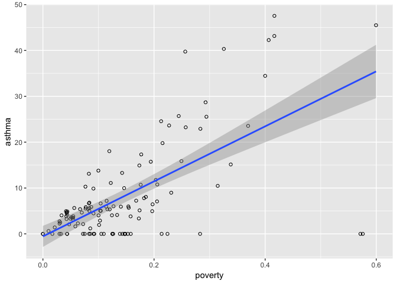
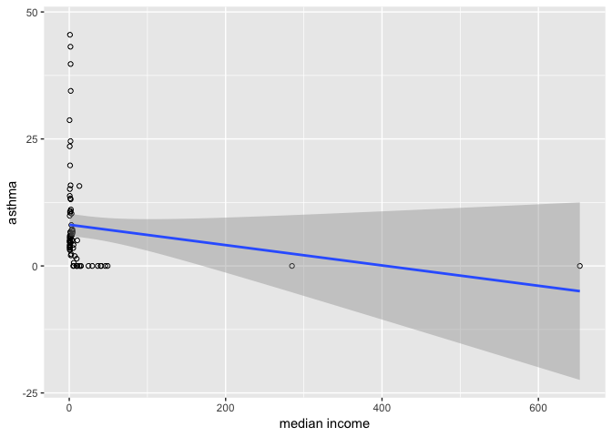
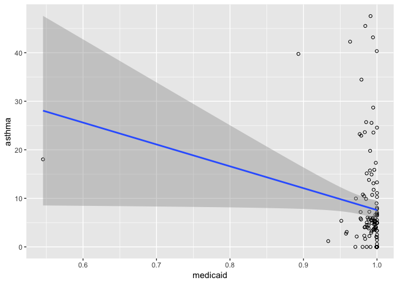
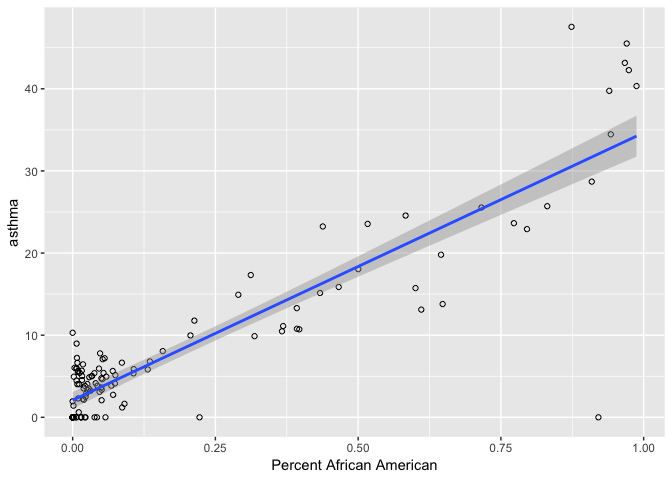
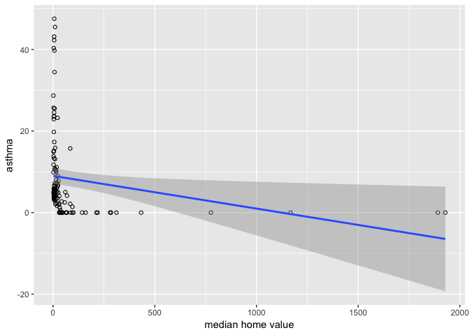

Graphing demographic with asthma
================
Ava
(December 06, 2019)

``` r
# tidyverse packages
library(dplyr)       # data wrangling
```

    ## 
    ## Attaching package: 'dplyr'

    ## The following objects are masked from 'package:stats':
    ## 
    ##     filter, lag

    ## The following objects are masked from 'package:base':
    ## 
    ##     intersect, setdiff, setequal, union

``` r
library(readr)       # read/write tabular data
library(stringr)     # work with strings
library(tidyr)       # data wrangling
# spatial packages
library(janitor)     # data wrangling
library(sf)          # spatial data tools
```

    ## Linking to GEOS 3.6.1, GDAL 2.1.3, PROJ 4.9.3

``` r
library(mapview)     # projections
library(tigris)      # census data wrangling 
```

    ## To enable 
    ## caching of data, set `options(tigris_use_cache = TRUE)` in your R script or .Rprofile.

    ## 
    ## Attaching package: 'tigris'

    ## The following object is masked from 'package:graphics':
    ## 
    ##     plot

``` r
# other packages
library(here)        # file path management
```

    ## here() starts at /Users/avagagner/Desktop/Courses/GitHub/redliningAsthma-Zipcode

``` r
library(naniar)      # missing data
library(ggplot2)
library(viridis)      # palettes
```

    ## Loading required package: viridisLite

``` r
library(leaflet)
library(tidycensus) 
library(sp)
library(ggplot2)   
library(RColorBrewer)  # color palettes
library(viridis)       # color palettes
```

``` r
shapefile_pov <- st_read(here("data","clean", "demo", "poverty", "poverty.shp"), stringsAsFactors = FALSE)
```

    ## Reading layer `poverty' from data source `/Users/avagagner/Desktop/Courses/GitHub/redliningAsthma-Zipcode/data/clean/demo/poverty/poverty.shp' using driver `ESRI Shapefile'
    ## Simple feature collection with 127 features and 5 fields
    ## geometry type:  MULTIPOLYGON
    ## dimension:      XY
    ## bbox:           xmin: -91.39668 ymin: 37.97805 xmax: -90.10911 ymax: 39.2606
    ## epsg (SRID):    4269
    ## proj4string:    +proj=longlat +datum=NAD83 +no_defs

``` r
ggplot(shapefile_pov, aes(x = pv_prcn, y = asthm_r))+ geom_point(shape = 21)+
            labs(x = "poverty", y = "asthma") +
   geom_smooth(method='lm')
```

    ## Warning: Removed 2 rows containing non-finite values (stat_smooth).

    ## Warning: Removed 2 rows containing missing values (geom_point).



``` r
shapefile_income <- st_read(here("data","clean", "demo", "med_income", "med_income.shp"), stringsAsFactors = FALSE)
```

    ## Reading layer `med_income' from data source `/Users/avagagner/Desktop/Courses/GitHub/redliningAsthma-Zipcode/data/clean/demo/med_income/med_income.shp' using driver `ESRI Shapefile'
    ## Simple feature collection with 127 features and 5 fields
    ## geometry type:  MULTIPOLYGON
    ## dimension:      XY
    ## bbox:           xmin: -91.39668 ymin: 37.97805 xmax: -90.10911 ymax: 39.2606
    ## epsg (SRID):    4269
    ## proj4string:    +proj=longlat +datum=NAD83 +no_defs

``` r
ggplot(shapefile_income, aes(x = incm_pr, y = asthm_r))+ geom_point(shape = 21)+
            labs(x = "median income", y = "asthma") +
  geom_smooth(method='lm')
```

    ## Warning: Removed 48 rows containing non-finite values (stat_smooth).

    ## Warning: Removed 48 rows containing missing values (geom_point).



``` r
shapefile_medicaid <- st_read(here("data","clean", "demo", "medicaid", "medicaid.shp"), stringsAsFactors = FALSE)
```

    ## Reading layer `medicaid' from data source `/Users/avagagner/Desktop/Courses/GitHub/redliningAsthma-Zipcode/data/clean/demo/medicaid/medicaid.shp' using driver `ESRI Shapefile'
    ## Simple feature collection with 127 features and 5 fields
    ## geometry type:  MULTIPOLYGON
    ## dimension:      XY
    ## bbox:           xmin: -91.39668 ymin: 37.97805 xmax: -90.10911 ymax: 39.2606
    ## epsg (SRID):    4269
    ## proj4string:    +proj=longlat +datum=NAD83 +no_defs

``` r
ggplot(shapefile_medicaid, aes(x = prcnt_m, y = asthm_r))+ geom_point(shape = 21)+
            labs(x = "medicaid", y = "asthma") +
   geom_smooth(method='lm')
```

    ## Warning: Removed 2 rows containing non-finite values (stat_smooth).

    ## Warning: Removed 2 rows containing missing values (geom_point).



``` r
shapefile_aa <- st_read(here("data","clean", "demo", "precent_aa", "precent_aa.shp"), stringsAsFactors = FALSE)
```

    ## Reading layer `precent_aa' from data source `/Users/avagagner/Desktop/Courses/GitHub/redliningAsthma-Zipcode/data/clean/demo/precent_aa/precent_aa.shp' using driver `ESRI Shapefile'
    ## Simple feature collection with 127 features and 5 fields
    ## geometry type:  MULTIPOLYGON
    ## dimension:      XY
    ## bbox:           xmin: -91.39668 ymin: 37.97805 xmax: -90.10911 ymax: 39.2606
    ## epsg (SRID):    4269
    ## proj4string:    +proj=longlat +datum=NAD83 +no_defs

``` r
ggplot(shapefile_aa, aes(x = prcnt_a, y = asthm_r))+ geom_point(shape = 21)+
            labs(x = "Percent African American", y = "asthma") +
   geom_smooth(method='lm')
```

    ## Warning: Removed 2 rows containing non-finite values (stat_smooth).

    ## Warning: Removed 2 rows containing missing values (geom_point).



``` r
shapefile_home <- st_read(here("data","clean", "demo", "home_value", "home_value.shp"), stringsAsFactors = FALSE)
```

    ## Reading layer `home_value' from data source `/Users/avagagner/Desktop/Courses/GitHub/redliningAsthma-Zipcode/data/clean/demo/home_value/home_value.shp' using driver `ESRI Shapefile'
    ## Simple feature collection with 127 features and 5 fields
    ## geometry type:  MULTIPOLYGON
    ## dimension:      XY
    ## bbox:           xmin: -91.39668 ymin: 37.97805 xmax: -90.10911 ymax: 39.2606
    ## epsg (SRID):    4269
    ## proj4string:    +proj=longlat +datum=NAD83 +no_defs

``` r
ggplot(shapefile_home, aes(x = vl_prcn, y = asthm_r))+ geom_point(shape = 21)+
            labs(x = "median home value", y = "asthma") +
   geom_smooth(method='lm')
```

    ## Warning: Removed 7 rows containing non-finite values (stat_smooth).

    ## Warning: Removed 7 rows containing missing values (geom_point).


